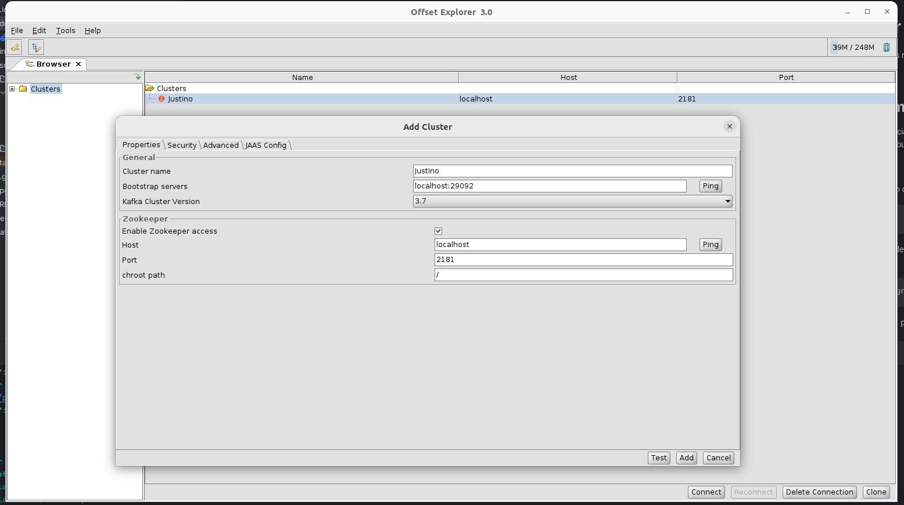

# INFO

Projeto de teste para implementação de solução de leitura e escrita no kafka com opção de ler de varias partições e topicos.

# Diretório docker

Neste diretório vou deixar os arquivos referentes a docker.

## docker-compose.yml

Estou subindo o kafka e o Zookeeper.

No arquivo estou subindo uma instancia do Zookeeper para consumir do kafka.


Para subir os serviços, basta utilizar o comando:
``` 
$ docker-compose up -d
```
Para verificar se o kafka ja terminou de subir, pode ser verificado via log:
```
$ docker-compose logs kafka | grep -i started
```
Para ter um acesso visual aos dados, pode ser utilizado o programa offsetExplorer:
https://kafkatool.com/download.html


## O projeto 

No projeto foi criado duas classes onde uma é a responsavel por produzir a mensagem/enviar mensagem e outra por consumir.

Da maneira apresentada pode ser feita por topico e partição.

### openapi-generator

Foi utilizado a geração de código olhando para o Swagger, assim facilitando a criação da interface e DTOs. 
Ficando apenas preeocupado com a implementação da Controller.

Foi construido uma API para enviar a mensagem via POST para o serviço e com isso postar no kafka.

### Async:

```
curl --location 'http://localhost:8081/v1/async/send' \
--header 'accept: application/json' \
--header 'Content-Type: application/json' \
--data '{
  "id": "4e7a2ee9-d044-41dc-8516-43948224d5c4",
  "message": "XPTO001",
  "timestamp": "2024-03-13T09:24:28.000"
}'
```
### Sync:

```
curl --location 'http://localhost:8081/v1/sync/send' \
--header 'accept: application/json' \
--header 'Content-Type: application/json' \
--data '{
  "id": "4e7a2ee9-d044-41dc-8516-43948224d5c4",
  "message": "XPTO001",
  "timestamp": "2024-03-13T09:24:28.000"
}'
```